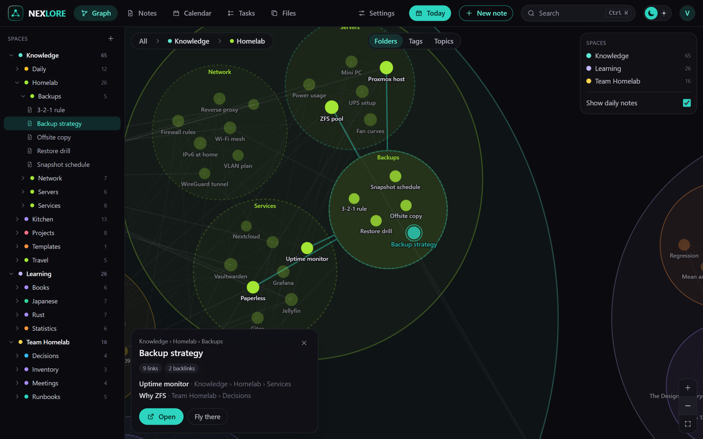
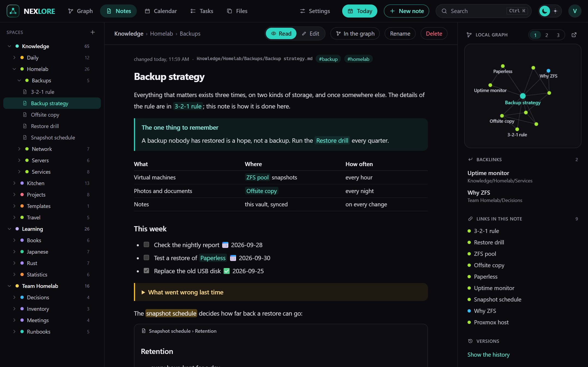
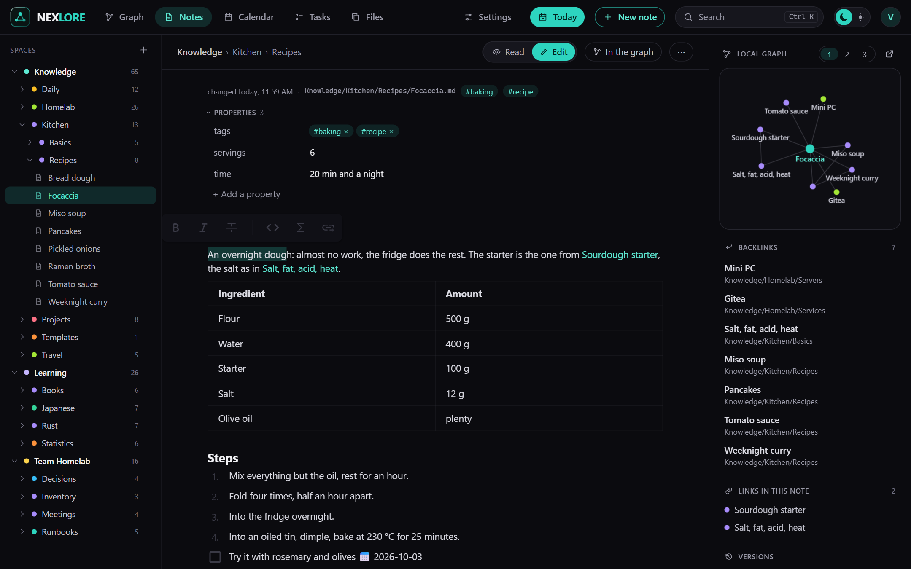
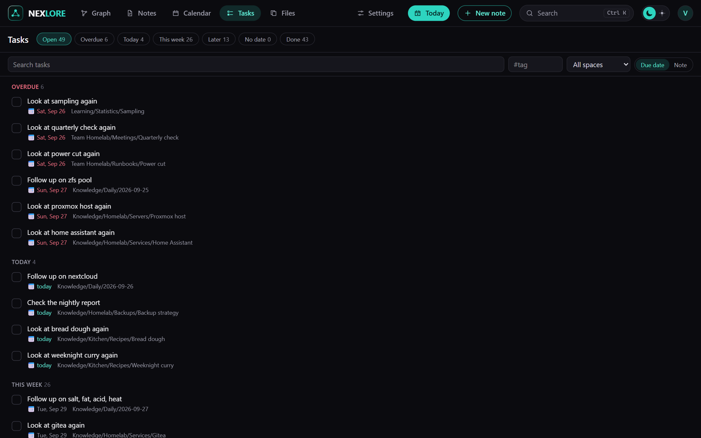
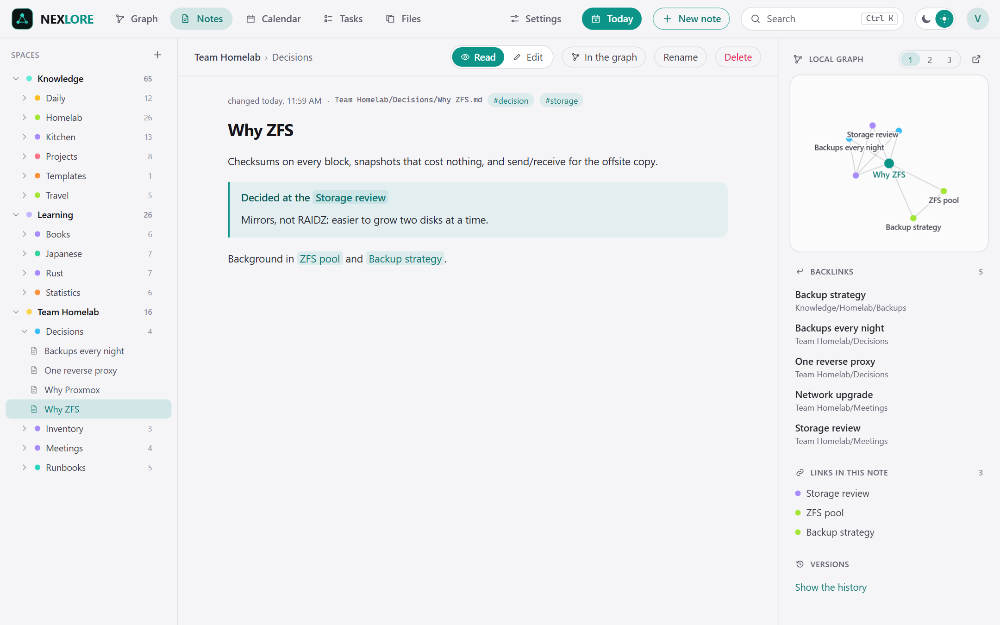
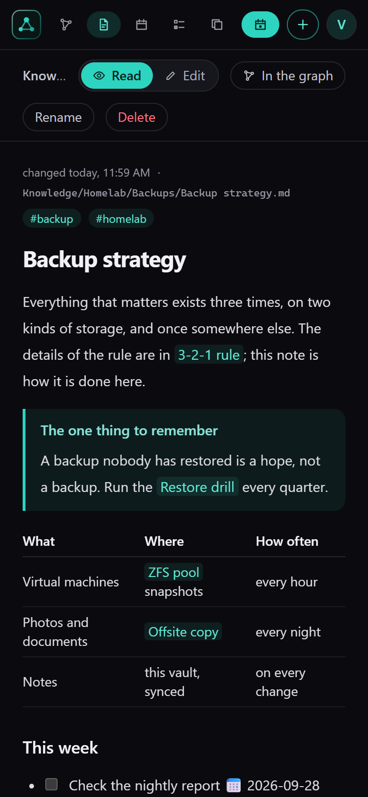

# nexlore

Notes as Markdown files, edited in the browser, with a graph you can zoom into. Self-hosted, for yourself or a
small team, and friendly to Obsidian: the files on disk stay the truth, and Obsidian, Syncthing or any editor may
work on the same folder at the same time.

nexlore is one of the nex apps and looks like them: turquoise, dark and light.



*The graph. Folders are bubbles; zoom in and they open to show their notes and the links between them. It is drawn
with WebGL and stays smooth with 100,000 notes. Folders, tags or topics found in the text, at the switch on top.*

## Screenshots



*Reading: callouts, tables, tasks, highlights and a part of another note embedded, the way Obsidian shows them. On
the right the local graph, the backlinks and every link of the note.*



*Editing: a visual editor with the front matter as a table of properties, a toolbar on selection and `/` to insert.
Only the blocks you touch are written back; the rest of the file stays byte for byte as it was.*



*Tasks from every note in the format of the Obsidian Tasks plugin, by due date or by note. Ticking one off writes
that one line and nothing else. Next to it: a calendar with the daily notes, and a daily note one key away.*

<p>
  
  
</p>

*Light and dark, and on the phone as an installable web app. Spaces for a team, with links from one space into
another that only resolve for people who may read both.*

## What it does

- **Files are the truth.** Every note is a Markdown file in a folder you choose. Changes from outside (Obsidian,
  VS Code, Syncthing) are picked up by a file watcher plus a full pass every five minutes. When a note changed
  elsewhere while you typed, your text goes into a conflict copy next to it; nothing is ever overwritten silently.
- **An editor that keeps what it did not change.** A visual editor (Milkdown) with a toolbar on selection, `/` to
  insert, Markdown shortcuts, properties from the front matter as a table. Only the blocks you touched are written
  back; every other line stays byte for byte as it was, line endings included.
- **Obsidian's way of writing**: wiki links `[[Note]]`, `[[Note#Heading|shown]]`, embeds `![[picture.png|300]]`
  and of notes or their parts (`![[Note#Heading]]`, `![[Note#^block]]`, one level deep), callouts (folding with
  `-` and `+`), highlights, comments `%%…%%`, tags, front matter, tasks in the format of the Tasks plugin. Plugin syntax
  (Dataview, Templater, Excalidraw) is shown as code and never touched. `.obsidian/` is left alone.
- **Links follow a rename.** Rename or move a note or a folder and every link to it is rewritten in the style it was
  written in, also in other spaces. Large renames rewrite their links in small parts, so nobody waits, and a server
  stopped half way carries on at its next start.
- **The graph**, drawn with WebGL: folders are bubbles that open as you zoom in (semantic zoom), grouped by folder,
  by tag or by topics worked out from the notes themselves. 100,000 notes stay fluid; the layout is computed on the
  server and loaded in tiles. Every note also shows its local graph.
- **Everyday use**: daily notes with a calendar, templates (`{{date}}`, `{{title}}` and friends), a task overview
  across all spaces (due, scheduled, recurring, done), installable on a phone as an app.
- **Attachments** next to the note in an `Attachments` folder, pasted pictures named after the note. Place and
  device are removed from photos and videos on upload (on by default), HEIC gets a WebP copy, duplicates are found
  by content, PDFs are searched. SVG, HTML and PDF are always downloaded, never run.
- **Spaces, accounts and rights**: a space is a folder at the top of the vault with members who read, write or
  manage. Links may lead into another space (`[[Team/Note]]`) and resolve only for whoever may read it. What
  somebody may not read does not show up anywhere, not in search, graph, backlinks or tasks, not even its title.
- **Sign-in** with a password and optionally a second factor (codes from an authenticator app, recovery codes), or
  through OpenID Connect (with a one-button setup for authentik). Invitations by link or by mail.
- **Public pages**: share a note or a folder as a reading page, with an expiry and a password if you like. Off until
  the operator opens it.
- **Versions and trash**: every save is a version (bundled per session, thinned out over time), deleted files wait
  30 days in the trash.
- **Backups** of the database and every file on a schedule, with a check that shows what a restore would change,
  and a download (the password is asked again) to keep a copy somewhere else.
- **AI from outside over MCP** (off by default): keys per account at three levels (read, drafts, write), each key
  optionally limited to some spaces. Drafts wait on the note until you take them over. See [docs/mcp.md](docs/mcp.md).
- **Plugins**, locked up in the browser: installed from the checked catalog that comes with nexlore (contents and
  reading time, queries, Kanban boards, rediscover old notes), let out by the operator, switched on by each person.
  See [docs/plugins.md](docs/plugins.md).
- **Import** of an Obsidian vault as a ZIP, with a report of what is special in it.
- English and German; another language is one JSON file, uploaded by the operator.

## Start

```yaml
services:
  nexlore:
    build: .
    container_name: nexlore
    restart: unless-stopped
    ports:
      - "8470:8000"
    volumes:
      - ./data:/data
    environment:
      PUID: 1000
      PGID: 1000
      TZ: Europe/Berlin
```

```
docker compose up -d --build
```

Open `http://<your-host>:8470`. The first account you create there is the operator. `docker-compose.yml` in this
repository has the same service with every option explained.

**Put nexlore behind a reverse proxy with TLS** before you use it from anywhere but your own desk. Installing it on
a phone also needs HTTPS; browsers offer it only on secure origins.

## Your notes in a folder of their own

By default the notes live in `data/vault`. To keep them elsewhere, for example in a folder that Obsidian or
Syncthing also works on, mount it and point nexlore at it:

```yaml
    volumes:
      - ./data:/data
      - /srv/notes:/vault
    environment:
      NEXLORE_VAULT_DIR: /vault
```

The container adjusts the owner of `/data` to `PUID`/`PGID` on every start, but not of a vault mounted elsewhere:
that folder must already be writable for the user `PUID`/`PGID`.

Every folder at the top of the vault is a space. A space without members belongs to the operator; invite people
into it under Settings.

Some network shares and container mounts deliver no change notifications. Set `NEXLORE_WATCH_POLLING: "true"`
there, or rely on the full pass every five minutes.

## Where things are stored

Everything else lives in `/data`: the SQLite database `nexlore.db` (index, versions, trash, accounts), `secret.key`,
`backups/`, `logs/`, `trash/`, `locales/`. Mount it from a local disk, never from an SMB or NFS share: SQLite's
locking does not work reliably over network filesystems.

The database can always be rebuilt from the files, except for versions and the trash. Back it up with nexlore's own
backups (Settings, Backups), which copy it consistently while it runs, never by copying the file.

`secret.key` protects what the server must read on its own (the OIDC client secret, the mail password, the seeds of
second factors). It goes into every backup. A different key means second factors can no longer be checked; the
operator resets them.

A backup archive is a plain ZIP: the database, every note and file, and `secret.key`. Whoever has it has everything,
so keep downloaded copies as carefully as the data directory itself.

## Updating

With an image: `docker compose pull && docker compose up -d`. Built from source: pull the new code and run
`docker compose up -d --build`. nexlore adds what the database lacks at the start and backs the database up first;
nothing needs doing by hand. Make a backup before a big jump anyway (Settings, Backups).

## Environment

| Variable | Default | Meaning |
|---|---|---|
| `NEXLORE_DATA_DIR` | `/data` | Database, logs, backups, trash, languages |
| `NEXLORE_VAULT_DIR` | `<data>/vault` | The notes, as Markdown files |
| `NEXLORE_LOCALES_DIR` | `<data>/locales` | Extra languages, one JSON file each |
| `NEXLORE_SECRET_KEY` | created on first start | Protects server-side secrets; when set, it wins over `secret.key` |
| `NEXLORE_PUBLIC_URL` | from the request | The address people use to reach nexlore, for invitation links, public pages and the OIDC redirect. The setting under Settings, Sign-in wins when set |
| `NEXLORE_TRUSTED_PROXIES` | none | Addresses or networks of reverse proxies whose `X-Forwarded-For` is believed, comma separated. Without it every request counts as coming from its peer |
| `NEXLORE_WATCH_POLLING` | `false` | Watch the vault by polling, for mounts without change notifications |
| `NEXLORE_SCAN_INTERVAL` | `300` | Seconds between two full passes over the vault; `0` turns them off |
| `NEXLORE_SESSION_DAYS` | `30` | A browser session ends after this many days |
| `NEXLORE_LOG_LEVEL` | stored setting | `quiet`, `normal`, `detailed` or `trace`; overrides the setting, the way out when the app does not start |
| `NEXLORE_COOKIE_SECURE` | `auto` | `on`, `off` or `auto` (from the request or `X-Forwarded-Proto`) |
| `NEXLORE_API_DOCS` | `false` | Serves `/api/docs` and `/api/openapi.json` |
| `NEXLORE_PORT` | `8000` | Port inside the container, for host networking |
| `PUID`, `PGID` | `1000` | Owner of the files in the data directory |

## Working next to Obsidian

nexlore reads a vault the way Obsidian does: a link finds the note of that name in the same folder first, then the
one with the shortest path; `[[Folder/Note]]` and relative Markdown links are read as paths. A link with the name
of another space in front (`[[Team/Note]]`) leads into that space; the own space always answers first, so a folder
called Team in your space wins over the space Team.

What nexlore writes stays readable for Obsidian: links in the style they had, file names that are safe on Windows,
macOS and Linux (a title with other characters goes into the front matter as `title:`), conflict copies named
`Note (conflict 2026-09-28 101500).md`. Tasks are counted outside code blocks and `%%comments%%` only.

## Security in short

- Passwords are at least 12 characters and hashed with Argon2id. Ten failed checks in a row lock an account for
  fifteen minutes, whatever address they come from; a brake per sender slows guessing on top.
- With a second factor, the password alone opens nothing: the sign-in waits for the code at most five minutes and
  five tries, a code counts once, and a right password does not reset the count of wrong codes. The seed is stored
  encrypted, recovery codes as hashes.
- A session alone is not enough for what would hand over other people's notes: downloading a backup, giving
  another account a password, resetting its second factor, changing a role or deleting an account ask for the
  operator's own password once more, counted like a sign-in. An operator who signs in through the provider has no
  password in nexlore and is not asked.
- Every changing request needs the header `X-Nexlore-Client`, which a page on another site cannot send.
- A space somebody may not read answers exactly like one that does not exist, in every route.
- Uploaded files are served with their own sandboxing policy; SVG, HTML and PDF only as downloads.
- Plugins run in sandboxed frames without an origin, without cookies and without network, and may only ask the page
  for what their manifest lists.
- MCP keys are shown once and stored as hashes, work only as a Bearer header, never from a web page, and never reach
  further than their account (or the spaces chosen for them).
- The log never contains note contents, passwords, keys or tokens; a test scans the code for the obvious mistakes.

## Development

```
cd backend && python -m venv .venv && .venv/Scripts/python -m pip install -r requirements-dev.txt
.venv/Scripts/python -m uvicorn app.main:app --port 8470
cd frontend && npm ci && npx vite
```

On Linux the virtual environment's programs are in `.venv/bin`. The frontend on port 5470 sends `/api` to the
backend. Tests: `python -m pytest -q` in `backend`; `npx vitest run`, `npm run test:browser` (the editor in a real
browser) and `npm run e2e` (builds, starts its own backend, runs headless) in `frontend`.

## License

AGPL-3.0.
