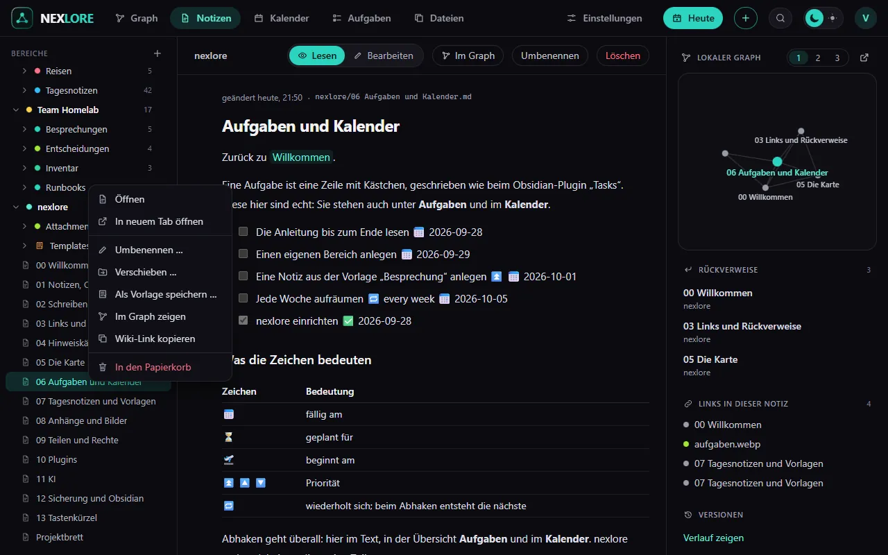

# Notizen, Ordner und Bereiche

Zurück zu [[00 Willkommen|Willkommen]].

## Bereiche

Ein **Bereich** ist ein Ordner ganz oben, zum Beispiel „Privat“, „Arbeit“ oder dieser hier, „nexlore“. Jeder Bereich hat eigene Mitglieder: Wer ihn anlegt, verwaltet ihn und lädt andere ein, zum Lesen, Schreiben oder Verwalten.

Einen neuen Bereich legst du mit dem **+** neben „BEREICHE“ in der Seitenleiste an. Umbenennen darf ihn, wer ihn verwaltet: Rechtsklick auf den Bereich, dann **Umbenennen**. Links, die den Bereich vorn nennen, etwa `[[Arbeit/Plan]]`, ziehen dabei in allen Bereichen nach.

## Ordner und Notizen

- **Neue Notiz:** der Knopf **+** oben in der Kopfleiste, das **+** neben einem Ordner oder `Alt+N`. Im Dialog wählst du den Ort und auf Wunsch eine Vorlage.
- **Neuer Ordner, Umbenennen, Verschieben, Löschen:** Rechtsklick auf einen Ordner oder eine Notiz in der Seitenleiste. Auf dem Handy hältst du den Finger kurz darauf.
- **Symbol und Farbe:** ebenfalls im Rechtsklick-Menü. Die Farbe gilt auch für die Ordner darin, das Symbol erscheint auch auf der Karte.
- **Ziehen:** Eine Notiz oder einen Ordner ziehst du in der Seitenleiste auf einen anderen Ordner. Mit den Pfeiltasten wanderst du durch den Baum, `Enter` öffnet.
- **Wohin Neues kommt:** Neue Notiz, **Heute** und **Schnell erfassen** landen im Bereich der offenen Notiz. Ist keine offen, im Hauptbereich, den du unter **Einstellungen → Allgemein** wählst.

## Suchen

`Strg+K` springt zu einer Notiz, `Strg+Shift+F` öffnet die große Suche. Sie findet Wörter auch mitten im Wort und versteht:

| Eingabe | findet |
| --- | --- |
| `garten OR balkon` | Notizen mit einem der beiden Wörter |
| `"grüne Bohnen"` | genau diese Wörter hintereinander |
| `tag:rezept` | Notizen mit dem Tag, auch mit Unter-Tags |
| `path:Rezepte` | Notizen, deren Pfad das enthält |
| `-tag:entwurf` | alles ohne diesen Tag (das Minus geht vor jedem Operator) |

Ein Klick auf einen Treffer öffnet die Notiz an der Stelle, an der er steht.

## Gelöscht ist nicht weg

Was du löschst, liegt 30 Tage im Papierkorb auf der Seite **Dateien**. Jede gespeicherte Fassung einer Notiz findest du im Reiter **Versionen** in der Spalte neben der Notiz (`Alt+R`).

Weiter mit [[02 Schreiben im Editor]].
