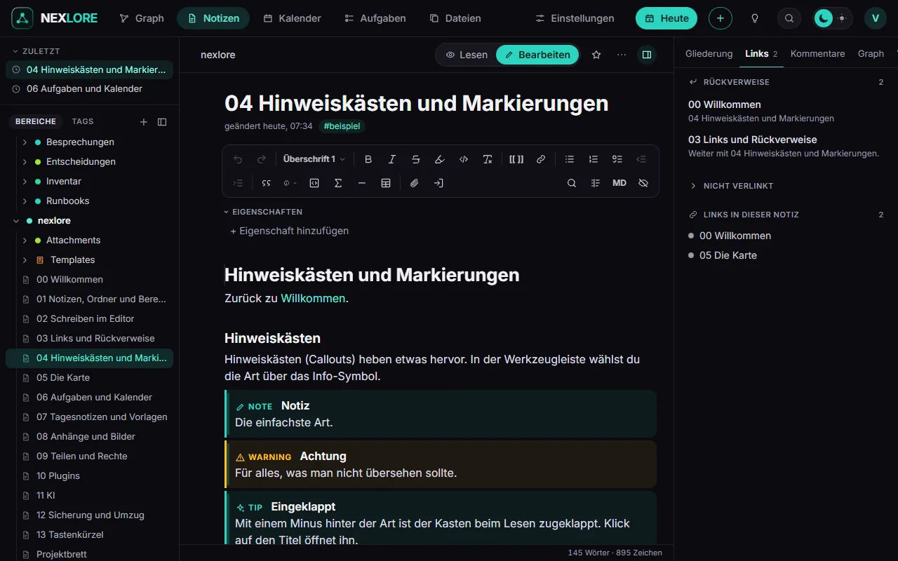

# Schreiben im Editor

Zurück zu [[00 Willkommen|Willkommen]].

Mit **Bearbeiten** öffnest du den Editor. Er zeigt den Text so, wie er später aussieht, und speichert von selbst, kurz nachdem du aufhörst zu tippen.

## Drei Wege zum Format

1. **Die Werkzeugleiste oben:** Absatzart, **fett**, *kursiv*, ~~durchgestrichen~~, Listen, Tabellen, Hinweiskästen und mehr. Mit dem Auge-Symbol ganz rechts blendest du sie aus. Auf dem Handy liegt sie als schmale Zeile über der Tastatur.
2. **Der Schrägstrich:** Tipp `/` am Anfang einer Zeile, dann ein Wort wie „Tabelle“ oder „Aufgabe“.
3. **Markdown direkt:** `**fett**`, `# Überschrift` oder `- ` für eine Liste gehen genauso.

Ein Rechtsklick in den Text öffnet ein Menü mit Format, Absatz und Einfügen.

## Der Griff neben jedem Absatz

Fährst du mit der Maus über einen Absatz, erscheinen links ein **+** und acht Punkte. Das **+** fügt darunter einen neuen Block ein. An den acht Punkten ziehst du den Absatz an eine andere Stelle; ein Klick darauf markiert ihn ganz.

## Eigenschaften

Im Editor steht über dem Text der Bereich **Eigenschaften**. Das sind kurze, feste Angaben *über* die Notiz, getrennt vom eigentlichen Text: Worum geht es, wie weit ist sie, bis wann, wer kümmert sich. Diese Notiz hat zwei davon: `thema` und `stand`.

**Wozu das gut ist**

- **Suchen:** Die Suche findet Notizen nach ihren Eigenschaften, zum Beispiel `[thema:Editor]` oder `[status:offen]`.
- **Ansichten:** Eine Ansicht (Tabelle, Karten, Liste, Brett) zeigt Eigenschaften als Spalten und sortiert oder gruppiert danach, etwa ein Brett mit einer Spalte je `status`.
- **Namen mit fester Bedeutung:**
  - `tags`: die Tags der Notiz, als Chips gezeigt.
  - `aliases`: weitere Namen. Der Schnellwechsler (Strg+K) und `[[` finden die Notiz auch unter ihnen.
  - `cssclasses`: zum Beispiel `wide`, dann steht die Notiz in voller Breite.
  - `title`: der Titel, wenn er Zeichen enthält, die ein Dateiname nicht kann.

**So gehst du damit um**

- **Eigenschaft hinzufügen** legt eine neue Zeile an: links der Name, rechts der Wert.
- Fährst du über eine Zeile, erscheint rechts die **Art**: Text, Liste, Zahl, Häkchen, Datum oder Datum mit Uhrzeit. Listen zeigen ihre Einträge als Chips, Daten öffnen einen Kalender. Das **×** daneben entfernt die Zeile.
- Gespeichert wird wie der Text von selbst, und in der Datei ändert sich nur die geänderte Zeile.
- Der kleine Pfeil vor „Eigenschaften“ klappt den Bereich zu und wieder auf.
- In der Datei stehen die Eigenschaften oben zwischen zwei Zeilen mit `---` (Frontmatter), so wie Obsidian sie schreibt. **MD** in der Werkzeugleiste zeigt sie so.
- Die Leseansicht zeigt nur den Text; die Eigenschaften siehst du beim Bearbeiten. Auf öffentlichen Seiten bleiben sie verborgen.

## Nur was du änderst, ändert sich

nexlore schreibt beim Speichern nur die Absätze neu, die du bearbeitet hast. Der Rest der Datei bleibt Zeichen für Zeichen, wie er war. Wer lieber den reinen Text sieht: **MD** in der Werkzeugleiste zeigt die Markdown-Ansicht.

Weiter mit [[03 Links und Rückverweise]].
