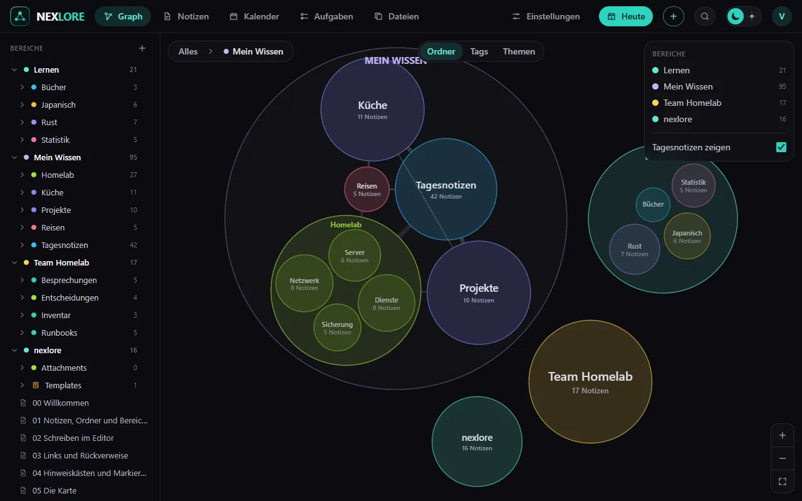

# Die Karte

Zurück zu [[00 Willkommen|Willkommen]].

Der Reiter **Graph** zeigt alle Bereiche als Karte. Ordner sind Blasen, Notizen Punkte, Links Linien.

## Hineinzoomen

- **Scrollen** oder zwei Finger zoomen. Eine Blase öffnet sich, wenn sie groß genug ist, und zeigt, was darin liegt.
- **Klick auf eine Blase** fliegt hinein, **Doppelklick auf einen Punkt** öffnet die Notiz.
- Oben links steht, wo du gerade bist; ein Klick darauf fliegt zurück.

## Drei Sichten

Oben in der Mitte wechselst du die Wolken:

1. **Ordner:** so, wie die Dateien liegen.
2. **Tags:** jede Notiz unter ihrem ersten Tag.
3. **Themen:** nexlore gruppiert Notizen nach ihren Wörtern und nennt jede Gruppe nach drei Stichwörtern.

## Der lokale Graph

Rechts neben jeder Notiz zeigt ein kleiner Graph ihre Nachbarn. Mit 1, 2 und 3 stellst du ein, wie viele Links weit er reicht.

Weiter mit [[06 Aufgaben und Kalender]].
