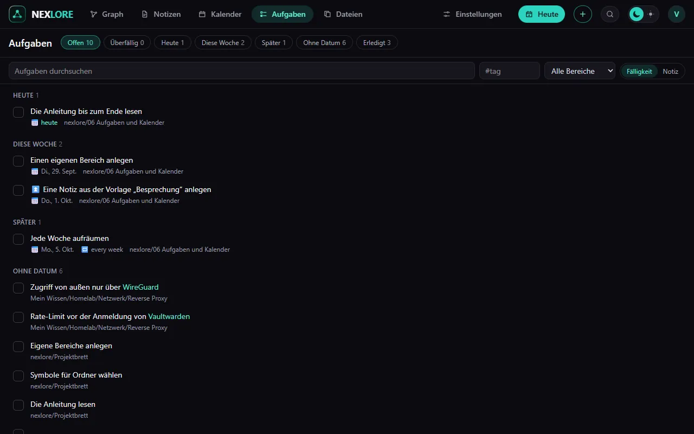

# Aufgaben und Kalender

Zurück zu [[00 Willkommen|Willkommen]].

Eine Aufgabe ist eine Zeile mit Kästchen, dazu nach Wunsch Fälligkeit, Priorität und Wiederholung. Diese hier sind echt: Sie stehen auch unter **Aufgaben** und im **Kalender**.

- [ ] Die Anleitung bis zum Ende lesen 📅 ⟦+0⟧
- [ ] Einen eigenen Bereich anlegen 📅 ⟦+1⟧
- [ ] Eine Notiz aus der Vorlage „Besprechung“ anlegen ⏫ 📅 ⟦+3⟧
- [ ] Jede Woche aufräumen 🔁 every week 📅 ⟦+7⟧
- [x] nexlore einrichten ✅ ⟦+0⟧

## Was die Zeichen bedeuten

| Zeichen | Bedeutung |
| --- | --- |
| 📅 | fällig am |
| ⏳ | geplant für |
| 🛫 | beginnt am |
| ⏫ 🔼 🔽 | Priorität |
| 🔁 | wiederholt sich; beim Abhaken entsteht die nächste |

Abhaken geht überall: hier im Text, in der Übersicht **Aufgaben** und im **Kalender**. nexlore ändert dabei nur diese eine Zeile.

Eine Aufgabe mit `[-]` gilt als abgebrochen. Sie steht in der eigenen Gruppe **Abgebrochen** und zählt weder als offen noch als erledigt.

## Der Kalender

Der Reiter **Kalender** zeigt den Monat mit allem, was fällig ist. Monat und Jahr wählst du oben, ebenso den Tag, mit dem die Woche beginnt. Ein Klick auf einen Tag öffnet dessen Tagesnotiz oder legt sie an, siehe [[07 Tagesnotizen und Vorlagen]].

Fällige Aufgaben im eigenen Kalenderprogramm: unter **Mein Konto → Verbindungen → Kalender-Abo**, sobald der Betreiber Kalender-Abos erlaubt hat.

Weiter mit [[07 Tagesnotizen und Vorlagen]].
