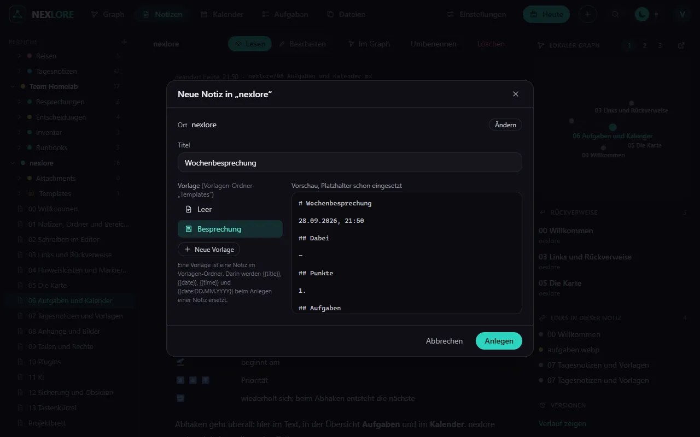

# Anhänge und Bilder

Zurück zu [[00 Willkommen|Willkommen]].

Bilder und Dateien ziehst du in den Editor, fügst sie mit `Strg+V` ein oder wählst sie über die Büroklammer in der Werkzeugleiste. nexlore legt sie im Ordner „Attachments“ neben der Notiz ab und verlinkt sie mit einem normalen Markdown-Link, so wie das Bild hier:

## Was nexlore mit Dateien tut

- **Ort und Gerät** entfernt nexlore beim Hochladen aus Fotos und Videos (der Betreiber kann das abschalten).
- **HEIC-Fotos** vom iPhone bekommen eine WebP-Fassung, die jeder Browser zeigt.
- **Doppelte** erkennt nexlore am Inhalt und verlinkt die vorhandene Datei.
- **PDFs** werden durchsucht: Die Suche findet auch Text darin.
- Verschiebst du eine Notiz, wandern ihre Anhänge mit.

Die Seite **Dateien** zeigt alle Anhänge eines Bereichs, auch die, die keine Notiz mehr benutzt.

Weiter mit [[09 Teilen und Rechte]].
