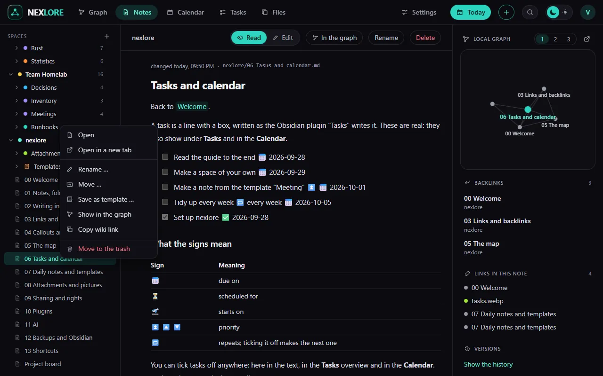

# Notes, folders and spaces

Back to [[00 Welcome|Welcome]].

## Spaces

A **space** is a folder at the very top, like "Private", "Work" or this one, "nexlore". Every space has members of its own: whoever makes it manages it and invites others, to read, to write or to manage.

Make a new space with the **+** beside "SPACES" in the sidebar. Whoever manages it may rename it: right click on the space, then **Rename**. Links that name the space in front, like `[[Work/Plan]]`, follow in every space.

## Folders and notes

- **New note:** the **+** button in the header, the **+** beside a folder, or `Alt+N`. The dialog lets you choose the place and, if you like, a template.
- **New folder, rename, move, delete:** right-click a folder or a note in the sidebar. On a phone, press and hold it.
- **Symbol and colour:** in the same menu. The colour holds for the folders inside too; the symbol shows on the map as well.
- **Dragging:** drag a note or a folder in the sidebar onto another folder. The arrow keys walk the tree, `Enter` opens.
- **Where new things go:** a new note, **Today** and **Quick capture** go into the space of the open note. With none open, into the main space you choose under **Settings → General**.

## Searching

`Ctrl+K` jumps to a note, `Ctrl+Shift+F` opens the big search. It finds words in the middle of words too and understands:

| Typed | finds |
| --- | --- |
| `garden OR balcony` | notes with either word |
| `"green beans"` | exactly these words in a row |
| `tag:recipe` | notes with the tag, nested tags included |
| `path:Recipes` | notes whose path holds it |
| `-tag:draft` | everything without this tag (the minus works before every operator) |

A click on a hit opens the note where the hit stands.

## Deleted is not gone

What you delete stays in the trash on the **Files** page for 30 days. Every saved version of a note is in the **Versions** tab of the column beside the note (`Alt+R`).

Next: [[02 Writing in the editor]].
