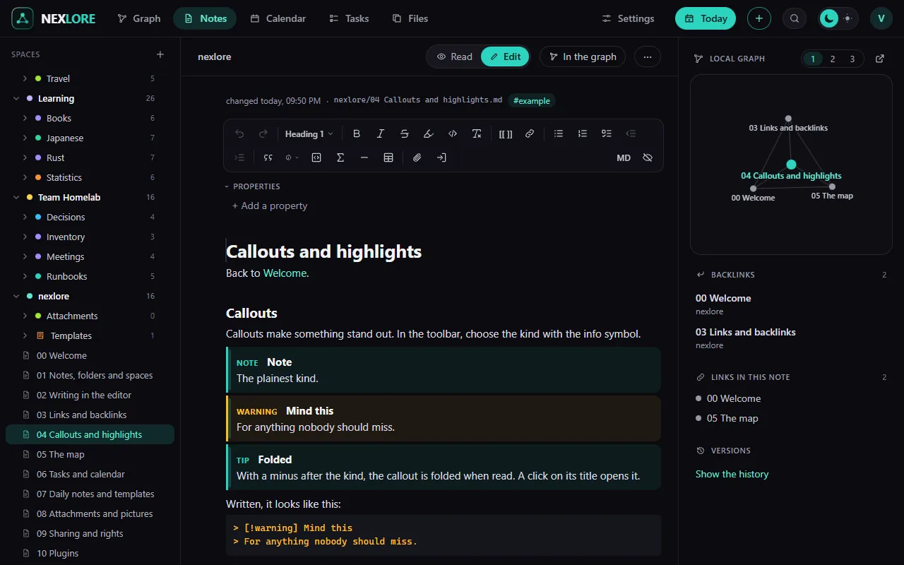

# Writing in the editor

Back to [[00 Welcome|Welcome]].

**Edit** opens the editor. It shows the text the way it will look, and saves by itself shortly after you stop typing.

## Three ways to format

1. **The toolbar at the top:** kind of paragraph, **bold**, *italic*, ~~struck through~~, lists, tables, callouts and more. The eye at the far right hides it. On a phone it is a narrow row above the keyboard.
2. **The slash:** type `/` at the start of a line, then a word like "table" or "task".
3. **Markdown itself:** `**bold**`, `# Heading` or `- ` for a list work just as well.

> [!tip] Practise Markdown
> To learn Markdown from scratch, practise on the website with small tasks: [Practise Markdown](https://www.nexlore.de/en/guide/practice/). You don't need an account, and what you practise there works the same here.

A right-click into the text opens a menu with format, paragraph and insert.

## The grip beside every paragraph

Move the mouse over a paragraph and a **+** and eight dots appear on its left. The **+** adds a new block below. Drag the eight dots to move the paragraph elsewhere; a click on them selects it whole.

## Properties

In the editor, above the text, is the part called **Properties**. They are short, fixed facts *about* the note, apart from its text: what it is about, how far along it is, until when, who looks after it. This note has two of them: `topic` and `as of`.

**What they are good for**

- **Searching:** the search finds notes by their properties, for example `[topic:Editor]` or `[status:open]`.
- **Views:** a view (table, cards, list, board) shows properties as columns and sorts or groups by them, a board with a column for each `status`, say.
- **Names with a meaning of their own:**
  - `tags`: the note's tags, shown as chips.
  - `aliases`: more names. The quick switcher (Ctrl+K) and `[[` find the note by them too.
  - `cssclasses`: `wide`, for example, shows the note at full width.
  - `title`: the title, when it holds characters a file name cannot.

**How to work with them**

- **Add a property** makes a new row: the name on the left, the value on the right.
- Move over a row and its **kind** shows on the right: text, list, number, checkbox, date or date and time. Lists show their entries as chips, dates open a calendar. The **×** beside it removes the row.
- They are saved by themselves like the text, and in the file only the row that changed changes.
- The small arrow before "Properties" folds the part shut and open again.
- In the file the properties stand at the top between two lines of `---` (front matter), the way Obsidian writes them. **MD** in the toolbar shows them so.
- While reading, the properties stand in a box above the text that you can fold shut; folded, it stays so for every note. You change them only while editing. Public pages leave them out.

## Only what you change changes

When saving, nexlore writes anew only the paragraphs you edited. The rest of the file stays as it was, character for character. If you prefer the plain text: **MD** in the toolbar shows the Markdown view.

Next: [[03 Links and backlinks]].
