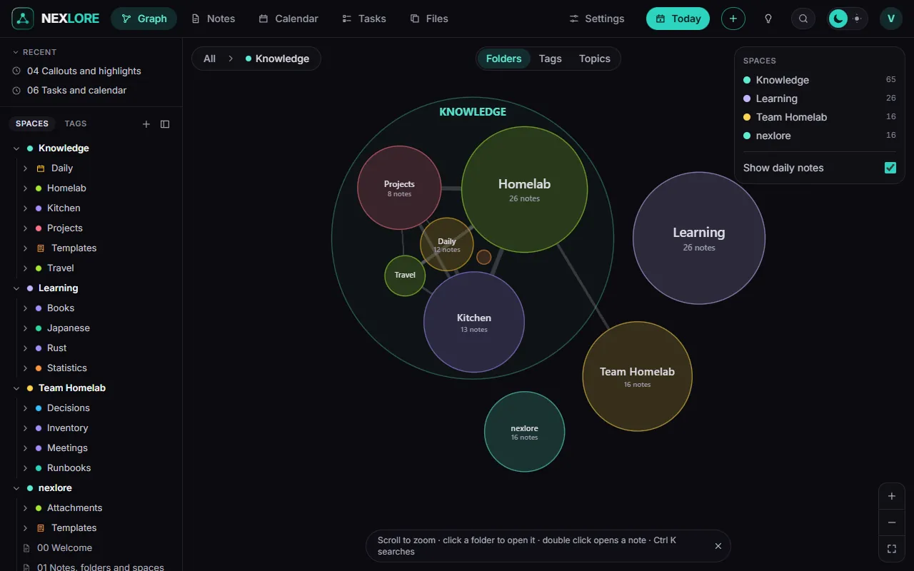

# The map

Back to [[00 Welcome|Welcome]].

The **Graph** tab shows every space as a map. Folders are bubbles, notes are dots, links are lines.

## Zooming in

- **Scroll** or use two fingers to zoom. A bubble opens once it is large enough and shows what is inside.
- **A click on a bubble** flies into it, **a double click on a dot** opens the note.
- The top left says where you are; a click there flies back.

## Three views

At the top in the middle you switch the clouds:

1. **Folders:** the way the files lie.
2. **Tags:** every note under its first tag.
3. **Topics:** nexlore groups notes by their words and names each group after three keywords.

## The local graph

Beside every note, a small graph shows its neighbours. 1, 2 and 3 set how many links far it reaches.

Next: [[06 Tasks and calendar]].
