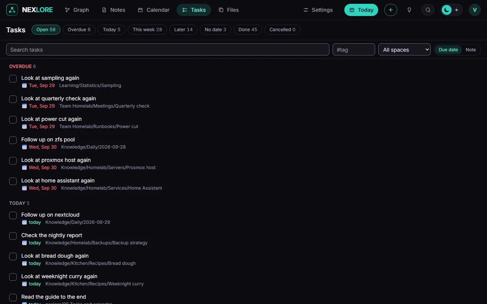

# Tasks and calendar

Back to [[00 Welcome|Welcome]].

A task is a line with a box, written as the Obsidian plugin "Tasks" writes it. These are real: they also show under **Tasks** and in the **Calendar**.

- [ ] Read the guide to the end 📅 ⟦+0⟧
- [ ] Make a space of your own 📅 ⟦+1⟧
- [ ] Make a note from the template "Meeting" ⏫ 📅 ⟦+3⟧
- [ ] Tidy up every week 🔁 every week 📅 ⟦+7⟧
- [x] Set up nexlore ✅ ⟦+0⟧

## What the signs mean

| Sign | Meaning |
| --- | --- |
| 📅 | due on |
| ⏳ | scheduled for |
| 🛫 | starts on |
| ⏫ 🔼 🔽 | priority |
| 🔁 | repeats; ticking it off makes the next one |

You can tick tasks off anywhere: here in the text, in the **Tasks** overview and in the **Calendar**. nexlore changes only that one line.

## The calendar

The **Calendar** tab shows the month with everything that is due. A click on a day opens its daily note, or makes it, see [[07 Daily notes and templates]].

Next: [[07 Daily notes and templates]].
