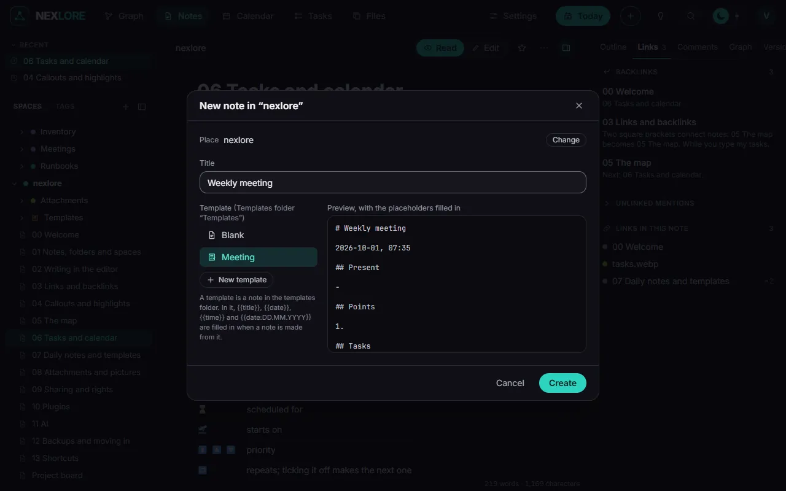

# Attachments and pictures

Back to [[00 Welcome|Welcome]].

Drag pictures and files into the editor, paste them with `Ctrl+V`, or pick them with the paper clip in the toolbar. nexlore puts them into the "Attachments" folder beside the note and links them with an ordinary Markdown link, like the picture here:

## What nexlore does with files

- **Place and device** are taken out of photos and videos on upload (the operator can switch that off).
- **HEIC photos** from an iPhone get a WebP copy that every browser shows.
- **Duplicates** are recognised by their content; the file already there is linked instead.
- **PDFs** are searched: the search finds text inside them too.
- When a note moves, its attachments go with it.

The **Files** page lists every attachment of a space, those no note uses any more too.

Next: [[09 Sharing and rights]].
